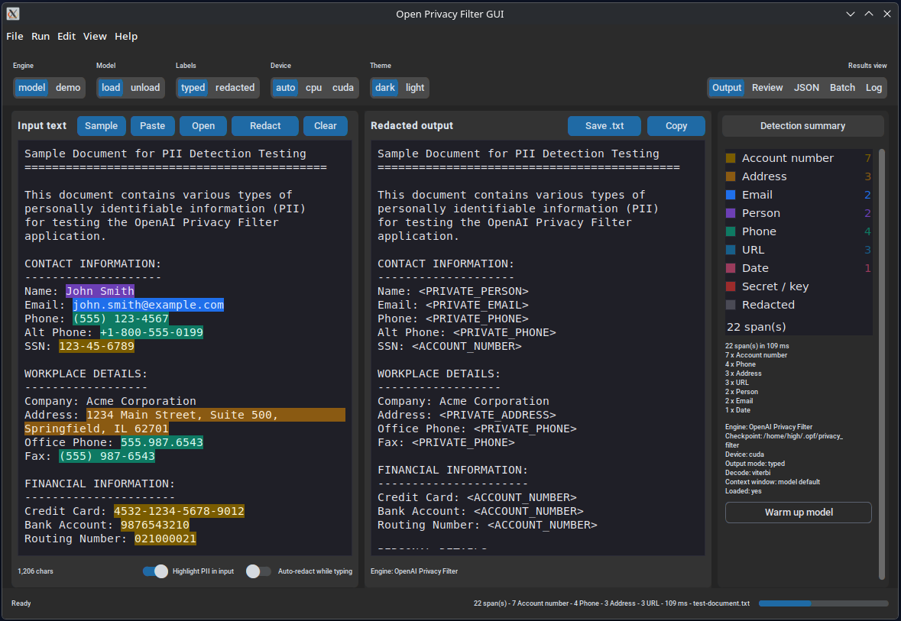

# OPF GUI — desktop front-end for OpenAI Privacy Filter

A local, offline desktop app around [`openai/privacy-filter`](https://github.com/openai/privacy-filter)
(`opf`): paste or drop in text, get PII-tagged output, review every detected span,
and export redacted text or schema-shaped JSON. Built with Python +
[customtkinter](https://github.com/TomSchimansky/CustomTkinter); nothing leaves your machine.



## Project structure

```
opf_gui/
  app.py          main window, results views, toolbar, dialogs
  backends.py     real `opf` backend + offline regex demo backend
  dnd.py          optional drag & drop (tkinterdnd2), degrades silently
  engine.py       worker thread, cancel, progress messages
  formatting.py   span maths, JSON/JSONL/Markdown exports
  models.py       settings, spans, label metadata
  prompt.md       Original prompt used with unsloth/Qwen3.8-Flash-Next-GGUF:UD-Q4_K_XL
  theme.py        PII colour palettes, light/dark colours, ghost buttons
  widgets.py      highlighted text panes, span table, legend, log console
```

## Install

Requires a Python build that includes Tk (`python3-tk` on Debian/Ubuntu,
included in the python.org macOS/Windows installers).

```bash
cd privacy_filter_gui
pip install -r requirements.txt          # customtkinter only -> Demo mode works

# optional: the real model (pulls torch, tiktoken, huggingface_hub, ...)
pip install "opf @ git+https://github.com/openai/privacy-filter"

# optional: drag & drop of text files
pip install tkinterdnd2
```

Or with the project metadata: `pip install -e .[model,dnd]`.

Only `customtkinter` is required; `opf` and `tkinterdnd2` are optional extras the app
degrades without. `python -m opf_gui --check` reports every one of them, so a missing
package is visible before launch instead of only showing up as a Log-tab note.

The first Model run downloads the OPF checkpoint from Hugging Face to
`~/.opf/privacy_filter` (override with `OPF_CHECKPOINT=/path/to/checkpoint`).

## Run

```bash
python run_gui.py                 # or: python -m opf_gui
python -m opf_gui --demo          # force the offline regex engine
python -m opf_gui --check         # environment report, no GUI
python -m opf_gui -f notes.txt    # load a file at startup
python -m opf_gui --help
```

`--check` prints the environment report - dependencies first, then the next step to take:

```
  opf package     : NOT installed
  checkpoint      : not found (opf package not installed)
  tkinter         : available 3.12.3 - GUI toolkit
  customtkinter   : available 5.2.2 - themed widgets
  tkinterdnd2     : missing - drag & drop (optional)
  torch           : available 2.2.2 - model inference
  huggingface_hub : available 1.29.0 - checkpoint download
```

Optional dependencies are probed by import only. Whether the `tkdnd` native library behind
`tkinterdnd2` really loads is confirmed once the window exists; if it cannot load, the app
still starts and the Log tab says drag & drop is off.

## Using it

1. **Get text in** — the input buttons run in workflow order:
   `Sample` · `Paste` · `Open` · `Redact` · `Clear`.
   `Open` accepts multiple files; folders can also be **dropped onto the editor**
   (needs `tkinterdnd2` - listed by `--check`; the app logs a note and carries on without it).
2. **Redact** — `Redact` (or `Ctrl+Return`). The model runs in a worker thread,
   so the window stays responsive; `Cancel` (`Esc`) abandons a long job.
3. **Review** — the `Review` view lists every span (label, text, offsets, score,
   action). Click a row to jump to it in both panes; click a highlighted span in
   the input pane to select it in the table.
4. **Export** — `Copy`/`Save` for redacted text, plus JSON (OPF schema), JSONL
   for batches, and a Markdown report on the `Batch` view.

Results views: **Output** · **Review** · **JSON** · **Batch** · **Log**, switched by the
segmented control on the right of the toolbar (above the Detection summary), so the two
editor panes keep the same size in every view. The Log view is the running
activity feed (engine loads, redaction timings, file and export actions); warnings and
errors are colour-coded, `Copy log` puts the whole feed on the clipboard for support tickets,
and it trims itself to the last ~1000 lines.
Toolbar: engine (`model`/`demo`), model (`load`/`unload`), labels (`typed`/`redacted`),
device (`auto`/`cpu`/`cuda`), theme (`dark`/`light`), results view (`Output`/`Review`/`JSON`/
`Batch`/`Log`). The Model toggle follows the engine:
`load` pulls the checkpoint into RAM (offering the one-time download if needed), `unload`
frees it again, and the segment tracks what is really resident - warm-up and the first
redaction also count as loaded. The sidebar shows engine status, span counts, the colour
legend and `Warm up model`; the full option sheet is under `View -> Advanced settings...`
and `Run` still offers Load / Warm up / Unload.
`Warm up model` is its own status light: accent-coloured like the other action buttons
while the model is cold, ghosted once a pass has run. Unloading or switching engine makes
the model cold again, and it is ghosted on the Demo engine, where there is no model to warm.

### Shortcuts

| Keys | Action |
| --- | --- |
| `Ctrl+Return` / numpad `Enter` | Redact |
| `Ctrl+O` / `Ctrl+S` | Open file / save redacted text |
| `Ctrl+Shift+C` | Copy redacted text |
| `Ctrl++` / `Ctrl+-` | Font size |
| `Esc` | Cancel running job |
| `F1` | About |
| `Ctrl+Q` | Quit |

### Demo mode

Without `opf` installed the app uses a regex heuristic engine so the UI is still
usable for triage and demos. **It is not a privacy control**: the sidebar says
so, and JSON exports carry a `warning` field naming the demo engine (the batch
Markdown report names the engine too). Plain-text saves carry no metadata, so
check the badge before you share redacted text. Use the `model` engine for
anything real.

## Tests

```bash
python tests/test_logic.py      # engine/formatting/settings logic (no GUI needed)
python tests/test_gui_smoke.py  # GUI wiring, via a tkinter/customtkinter stub
```

The GUI tests run headless: `tests/stub_gui.py` supplies just enough of Tk and
customtkinter to build the window and drive the workflows, so layout regressions
(button order, pane alignment, drag & drop, theme switching) fail loudly even on
a machine with no display.

## License

Released under the **Apache License 2.0** - see [LICENSE.txt](LICENSE.txt). Use, modify and
redistribute freely (including commercially) as long as you keep the copyright and license
notices and mark changed files.

What the license does **not** cover:

- The OPF model weights: a separate Hugging Face download under OpenAI's own terms -
  read them before deploying (source: opf_gui/app.py, `MODEL_URL`).
- Dependencies keep their own licenses: `customtkinter` (MIT), `tkinterdnd2` (BSD-style).

Nothing here is legal advice - check with whoever owns privacy sign-off before redacted
output leaves the building.

## Troubleshooting

- **`ModuleNotFoundError: customtkinter`** → `pip install customtkinter`.
- **`No module named tkinter`** → install Tk for your interpreter (`sudo apt install python3-tk`,
  or reinstall python.org Python with Tcl/Tk ticked).
- **`Unable to load tkdnd library` / drag-drop does nothing** → `pip install tkinterdnd2`
  (`python -m opf_gui --check` shows `tkinterdnd2 : missing`); the app keeps working with
  `Open` when it is missing. Toggle it in `Settings…`.
- **Model will not load** → `python -m opf_gui --check` reports whether `opf`,
  the checkpoint and enough RAM look available; `Settings…` lets you point at a
  local checkpoint directory.
- **First run is slow** → the checkpoint download plus model warm-up; use
  `Warm up model` in the sidebar, and set the toolbar `Model` toggle to `unload`
  (or `Run -> Unload model (free memory)`) when done.

## Colophon

This project was created using `prompt.md` with unsloth/Qwen3.8-Flash-Next-GGUF:UD-Q4_K_XL in Pi (pi.dev) on a Strix Halo (Max+ 395) system with 128 GB shared RAM running CachyOS. A little more back and forth with the agent cleaned up minor bugs and the UI layout.
